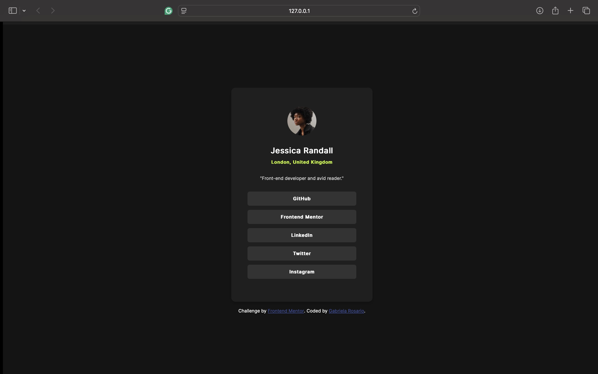

# Frontend Mentor - Social links profile solution

This is a solution to the [Social links profile challenge on Frontend Mentor](https://www.frontendmentor.io/challenges/social-links-profile-UG32l9m6dQ). Frontend Mentor challenges help you improve your coding skills by building realistic projects. 

## Table of contents

- [Overview](#overview)
  - [The challenge](#the-challenge)
  - [Screenshot](#screenshot)
  - [Links](#links)
  - [Built with](#built-with)
  - [What I learned](#what-i-learned)
  - [Continued development](#continued-development)
  - [Useful resources](#useful-resources)
- [Author](#author)

## Overview

### The challenge

Users should be able to:

- See hover and focus states for all interactive elements on the page.
- View the optimal layout depending on their device's screen sizes.

### Screenshot

### Links

- Solution URL: [solution URL here](https://github.com/rosariorgabriela/socialLinksProfile)
- Live Site URL: [live site URL here](https://rosariorgabriela.github.io/socialLinksProfile/)

### Built with
- Semantic HTML5 markup
- CSS custom properties
- Flexbox
- CSS Media Queries

### What I learned

I learned how to make a project fully responsive with CSS media queries, adjust layouts dynamically, and create hover effects for interactive elements like buttons with just CSS.

### Continued development

In the future I would like to:
- Explore more responsive design techniques.
- Add animations for a better user experience.
- Explore pseudo-class selectors in CSS.

### Useful resources

- [Resource 1](https://www.w3schools.com/css/css_pseudo_classes.asp) - This helped to change the background color of the buttons when the user hovers over it. I really liked this pattern and will use it going forward.

## Author
- Frontend Mentor - [@rosariorgabriela](https://www.frontendmentor.io/profile/rosariorgabriela)
- Github - [@rosariorgabriela](https://github.com/rosariorgabriela)